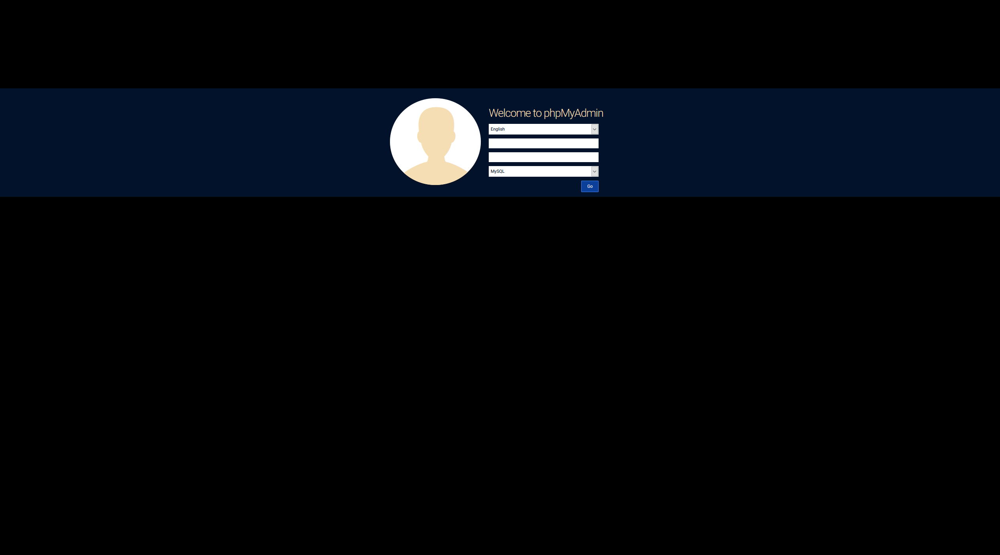
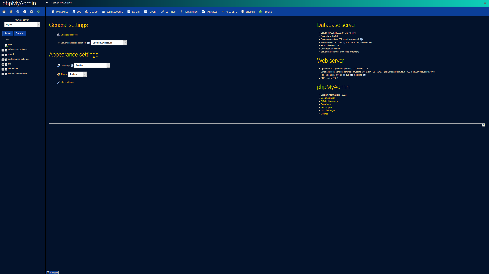
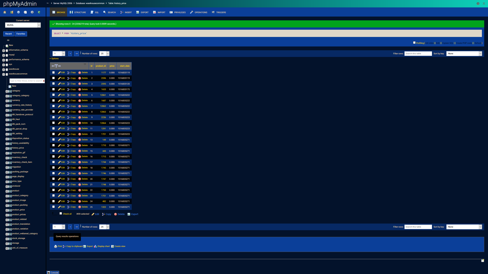

# Darken (phpMyAdmin Theme)

Dark theme for phpMyAdmin.

As base theme [fallen](https://github.com/fransallen/fallen) was taken and adjusted.

## Usage

* Move to your phpMyAdmin themes directory.
* Activate "Darken" from phpMyAdmin dashboard.
* Done.

## Version

[darken 1.0](https://files.phpmyadmin.net/themes/darken) for phpMyAdmin **4.9**

Maybe works with 4.8

> See all version in [phpMyAdmin Themes directory](https://www.phpmyadmin.net/themes/).

## Screenshot

## LICENSE

Licensed under GPL license. Please see the license file: 
